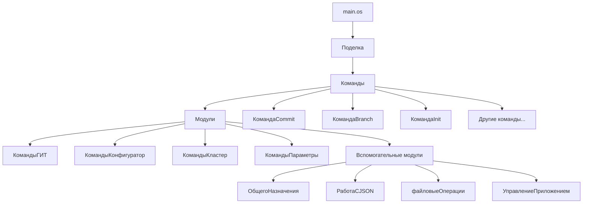
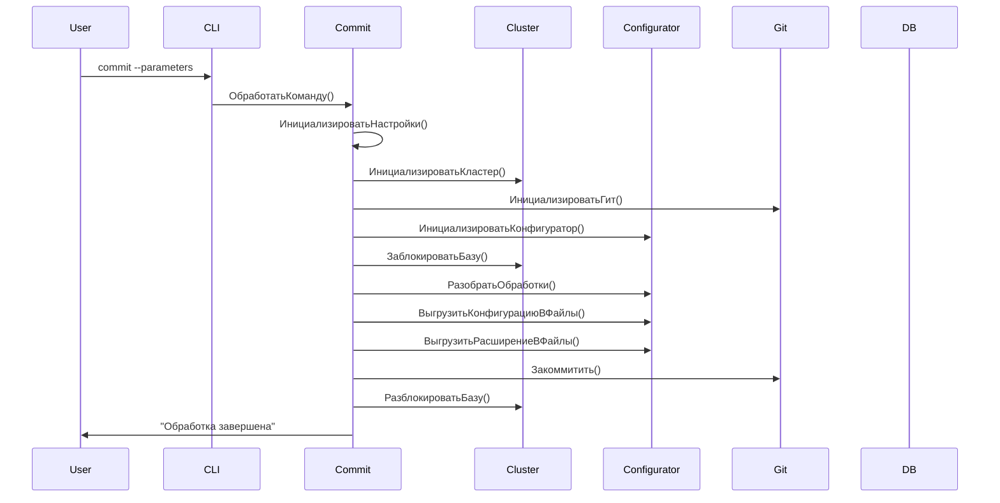
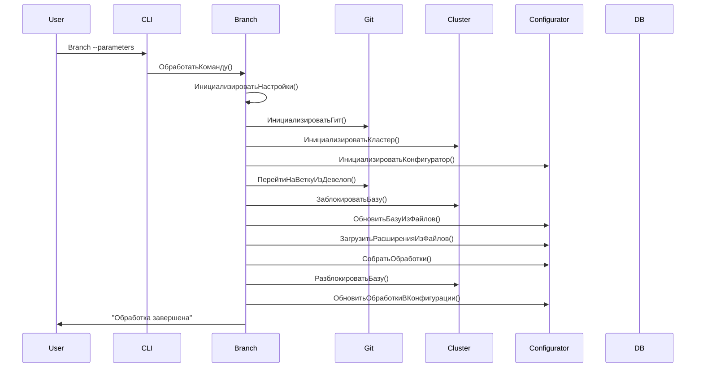

# 🏗️ Архитектура DevOps CLI

Этот документ описывает архитектуру и технические детали проекта DevOps CLI.

## 📐 Общая архитектура

DevOps CLI построен на основе **autumn-cli** фреймворка и следует принципам модульной архитектуры с четким разделением ответственности.



## 🧩 Основные компоненты

### 1. Точка входа (`main.os`)
```oscript
#Использовать autumn
#Использовать autumn-cli
#Использовать "./src"

Поделка = Новый Поделка();
Поделка.ЗапуститьПриложение();
```

**Роль:** Инициализация приложения и запуск CLI интерфейса.

### 2. Описание приложения (`ОписаниеCliПриложения.os`)
```oscript
Функция ИмяПриложения() Экспорт
    Возврат "devops";
КонецФункции

Функция ПолноеИмяПриложения() Экспорт
    Возврат "Девопс консольное приложение";
КонецФункции

Функция ВерсияПриложения() Экспорт
    Возврат "1.0.2";
КонецФункции
```

**Роль:** Метаданные приложения для CLI интерфейса.

## 🔧 Команды приложения

### Структура команды
Каждая команда следует единому паттерну:

```oscript
&Опция(Имя = "ParameterName", Описание = "Parameter description")
Перем ParameterName;

&КомандаПриложения(Имя = "command-name")
Процедура ПриСозданииОбъекта()
КонецПроцедуры

&ВыполнениеКоманды
Процедура ОбработатьКоманду() Экспорт
    // Логика выполнения команды
КонецПроцедуры
```

### Основные команды

#### `commit` - Создание коммита
**Назначение:** Декомпиляция конфигурации и создание коммита в Git.

**Алгоритм выполнения:**
1. Инициализация настроек и модулей
2. Блокировка базы данных
3. Декомпиляция обработок
4. Декомпиляция конфигурации (опционально)
5. Декомпиляция расширений
6. Создание коммита в Git
7. Разблокировка базы данных

**Ключевые параметры:**
- `PathRepository` - Путь к репозиторию
- `NameDB` - Имя информационной базы
- `Extensions` - Расширения конфигурации
- `TextCommit` - Текст коммита
- `LoadDB` - Обновлять базу из файлов

#### `Branch` - Создание ветки
**Назначение:** Создание новой ветки с обновлением конфигурации.

**Алгоритм выполнения:**
1. Инициализация настроек и модулей
2. Переход на новую ветку из develop
3. Блокировка базы данных
4. Обновление конфигурации из файлов (опционально)
5. Загрузка расширений
6. Компиляция обработок
7. Разблокировка базы данных
8. Обновление обработок в конфигурации

**Ключевые параметры:**
- `NewBranch` - Имя новой ветки
- `NamesDataProcessors` - Обработки для компиляции
- `LoadDB` - Обновлять базу из файлов

#### `init` - Инициализация репозитория
**Назначение:** Инициализация Git репозитория и настройка пользователя.

**Алгоритм выполнения:**
1. Инициализация Git репозитория
2. Настройка удаленного репозитория
3. Настройка пользователя Git

## 🔌 Модули системы

### 1. КомандыГИТ (`КомандыГИТ.os`)
**Назначение:** Управление Git операциями.

**Основные методы:**
- `Инициализировать()` - Инициализация Git
- `Закоммитить()` - Создание коммита
- `ПерейтиНаВеткуИзДевелоп()` - Переход на ветку из develop
- `СоздатьMergeRequest()` - Создание merge request

### 2. КомандыКонфигуратор (`КомандыКонфигуратор.os`)
**Назначение:** Работа с конфигурацией 1С.

**Основные методы:**
- `РазобратьОбработки()` - Декомпиляция обработок
- `ВыгрузитьКонфигурациюВФайлы()` - Выгрузка конфигурации
- `ОбновитьБазуИзФайлов()` - Обновление базы из файлов
- `СобратьОбработки()` - Компиляция обработок
- `ЗагрузитьРасширенияИзФайлов()` - Загрузка расширений

### 3. КомандыКластер (`КомандыКластер.os`)
**Назначение:** Управление кластером 1С.

**Основные методы:**
- `ЗаблокироватьБазу()` - Блокировка базы данных
- `РазблокироватьБазу()` - Разблокировка базы данных
- `Инициализировать()` - Инициализация кластера

### 4. КомандыПараметры (`КомандыПараметры.os`)
**Назначение:** Управление параметрами и настройками.

**Основные методы:**
- `Инициализировать()` - Инициализация параметров
- `ВернутьСвойство()` - Получение значения параметра
- `ЕстьСвойство()` - Проверка наличия параметра

## 🛠 Вспомогательные модули

### ОбщегоНазначения (`ОбщегоНазначения.os`)
**Назначение:** Общие функции и константы.

**Содержит:**
- Константы для типов СУБД
- Общие функции форматирования
- Утилитарные методы

### РаботаСJSON (`РаботаСJSON.os`)
**Назначение:** Работа с JSON данными.

**Основные методы:**
- `ПрочитатьJSON()` - Чтение JSON файла
- `ЗаписатьJSON()` - Запись JSON файла
- `ПарситьJSON()` - Парсинг JSON строки

### файловыеОперации (`файловыеОперации.os`)
**Назначение:** Файловые операции.

**Основные методы:**
- `ОбеспечитьПустойКаталог()` - Создание пустого каталога
- `КопироватьФайлы()` - Копирование файлов
- `УдалитьФайлы()` - Удаление файлов

### УправлениеПриложением
**Назначение:** Управление жизненным циклом приложения.

**Основные методы:**
- `ЗапуститьПриложение()` - Запуск приложения
- `ОстановитьПриложение()` - Остановка приложения
- `ПолучитьСтатус()` - Получение статуса

## 🔄 Потоки данных

### Поток выполнения команды commit


### Поток выполнения команды Branch


## 🔧 Конфигурация и настройки

### Файл настроек (`ФайлНастроек.xml`)
```xml
<?xml version="1.0" encoding="UTF-8"?>
<Settings xmlns="http://v8.1c.ru/8.3/config/merge/settings" 
          xmlns:xs="http://www.w3.org/2001/XMLSchema" 
          xmlns:xsi="http://www.w3.org/2001/XMLSchema-instance" 
          version="1.2" 
          platformVersion="8.3.11">
    <MainConfiguration>
        <Name>УправлениеСкладом</Name>
        <Version>4.5.10.69</Version>
        <Vendor>AXELOT</Vendor>
    </MainConfiguration>
    <SecondConfiguration>
        <Name>УправлениеСкладом</Name>
        <Version>4.5.10.69</Version>
        <Vendor>AXELOT</Vendor>
    </SecondConfiguration>
    <Parameters>
        <ConfigurationsRelation>ConfigurationsNotRelated</ConfigurationsRelation>
        <AllowMainConfigurationObjectDeletion>false</AllowMainConfigurationObjectDeletion>
        <CopyObjectsMode>false</CopyObjectsMode>
    </Parameters>
    <Objects>
    </Objects>
</Settings>
```

### Структура параметров
```oscript
НастройкиВыполнения = Новый Структура;
НастройкиВыполнения.Вставить("PathRepository", PathRepository);
НастройкиВыполнения.Вставить("NameDB", NameDB);
НастройкиВыполнения.Вставить("UsrLogin1c", UsrLogin1c);
// ... другие параметры
```

## 🔒 Безопасность

### Управление учетными данными
- Пароли передаются через параметры командной строки
- Рекомендуется использование переменных окружения
- Токены GitLab хранятся в переменных окружения

### Блокировка базы данных
- Автоматическая блокировка перед операциями
- Гарантированная разблокировка после завершения
- Обработка исключений для предотвращения зависших блокировок

## 📊 Логирование и мониторинг

### Уровни логирования
1. **Информационные сообщения** - ход выполнения операций
2. **Предупреждения** - потенциальные проблемы
3. **Ошибки** - критические проблемы

### Временные метки
```oscript
Лог.Информация(" Старт: Декомпиляция обработок в файлы " + ТекущаяДата());
// ... выполнение операции
Лог.Информация(" Конец: Декомпиляция обработок в файлы " + ТекущаяДата());
```

## 🔄 Расширяемость

### Добавление новых команд
1. Создать новый файл в `src/Классы/`
2. Следовать паттерну существующих команд
3. Добавить опции и логику выполнения
4. Обновить документацию

### Добавление новых модулей
1. Создать файл в `src/Модули/`
2. Реализовать необходимые методы
3. Интегрировать с существующими командами

## 🚀 Производительность

### Оптимизации
- Блокировка базы только на время операций
- Пакетная обработка файлов
- Кэширование настроек

### Мониторинг
- Измерение времени выполнения операций
- Отслеживание использования ресурсов
- Логирование производительности

---

Эта архитектура обеспечивает модульность, расширяемость и надежность системы, позволяя легко добавлять новые функции и адаптировать приложение под различные потребности. 