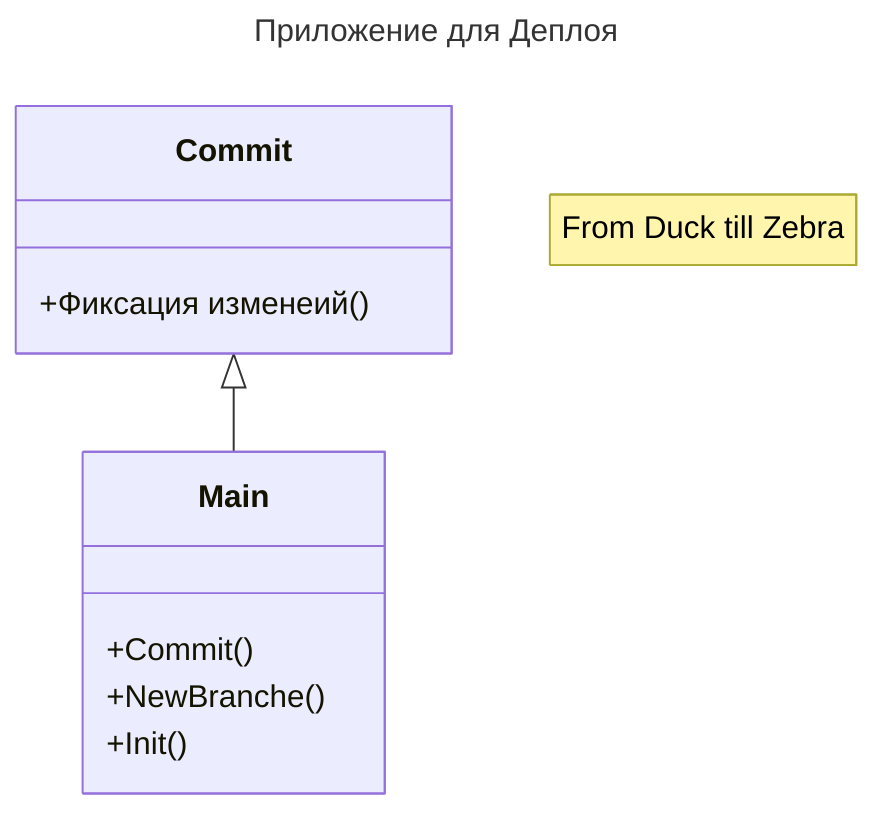

# autumn-cli-deploy

Реализация приложения на autumn-cli для целей компании (сборка разборка конфигурация)
При реализации были немного переделаны известные либы, по этому их выложии в текущий проект.

