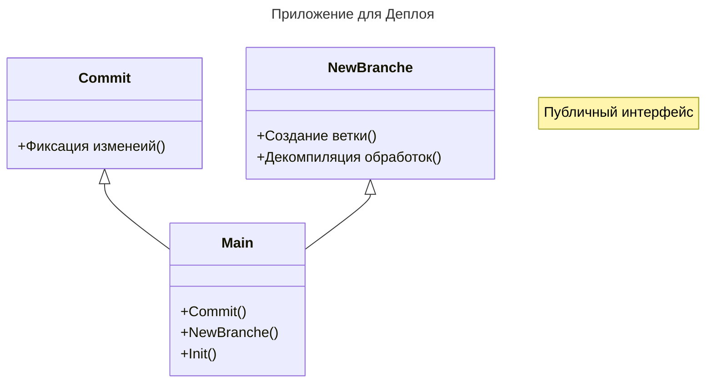

# autumn-cli-deploy

Реализация приложения на autumn-cli для целей компании (сборка разборка конфигурация)
При реализации были немного переделаны известные либы, по этому их выложии в текущий проект.

## Команда commit

- PathRepository - Путь репозитория
- NameDB - Имя информационной базы
- UsrLogin1c - Имя пользователя 1с
- UsrPswd1c - Пароль пользователя 1с
- PathServer1c - Путь к серверу
- NumberPlatform - Номер версии платформы 1с
- TypeDB - Тип СУБД
- UsrLoginDB - Имя пользователя СУБД
- UsrPswdDB - Пароль пользователя СУБД
- PathServerDB - Путь к серверу СУБД
- TextCommit - Текст коммита
- UrlGitLab - Ссылка на Гит лаб
- TokenConnectionGitLab - Токен подключения к гитлаб
- IdProject - ИД проекта Гит лаб (отдельно ВМС, отдельно ЕРП, отдельно ТМС)// Возвращаемое значение:

## Команда branche

- PathRepository - Путь репозитория
- NewBranche - Новая ветка
- NameDB - Имя информационной базы
- UsrLogin1c - Имя пользователя 1с
- UsrPswd1c - Пароль пользователя 1с
- PathServer1с - Путь к серверу 1с
- NumberPlatform - Номер версии платформы 1с
- TypeDB - Тип СУБД
- UsrLoginDB - Имя пользователя СУБД
- UsrPswdDB - Пароль пользователя СУБД
- PathServerDB - Путь к серверу СУБД
- RunRas - Запускать РАС
- NamesDataProcessors - Обработки через "," (запятая)
- LoadDB - Загрузка базы из файлов (истина, ложь)
- MethodLoadDB - ibcmd / designer

## Команда init

- PathRepository - Путь репозитория
- PathRemoteRepository - Путь удаленного репозитория
- UserName - Имя пользователя
- UserEmail - Почта пользователя

